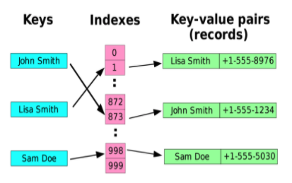
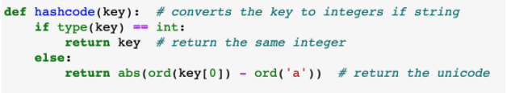
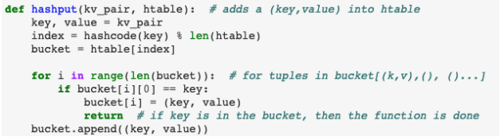
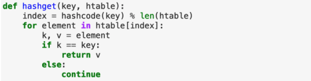

# Hash Table
## Introduction
A hash table is a data structure that can store values or key-value pairs in a way that is extremely efficient when searching for a single value. A hash table can store values or key-value pairs in different buckets so the program does not have to search through the entire structure to find a value, it only has to look through the bucket where the value is stored. Every hash table has a hash function that partitions the values into different buckets. The hash function is implemented in a way that assigns a value to a bucket index based on some characteristic of the value.

A concrete implementation of a hash table is often a list of lists. Each sublist of the list would be considered a bucket. The hash function would return an index of the array where the value or key-value pair should be stored. If the hash table is storing values, the hash table should be implemented to store that value in the index provided by hash(value). If the hash table is storing key-value pairs it should be implemented to store the key-value pair as a tuple in the index provided by hash(key). If the hash table is implemented effectively, each bucket should contain around the same number of values. A perfect hash table implementation would only have one value per bucket, making the search time very efficient at O(1).  

As you can see in the hash table graphic above, John Smith and his phone number are stored as a key-value pair in bucket 873. Now, when a user wants to find John Smith and his phone number, they only have to look through bucket 873 instead of all 999 buckets.

## Code Implementation for a Hash Table as a List of Lists:
### Hashcode Function
To partition the keys into buckets of the hash table, the keys are converted to indexes. The keys could be integers or strings. If the keys are integers, they can easily be converted to required indexes but string keys first need to be converted to integers. The hashcode function is used to perform this conversion. The input for the hashcode function is the key. If the key is an integer, it returns the key itself but if it’s a string, the expression abs(ord(key[0]) - ord('a')) converts the string to an integer. This expression calculates the Unicode of the first character of the key using the ord() function available in python 3. Then, normalizes it by subtracting the Unicode of the lower case alphabet ‘a’. The absolute value of this expression gives the final integer corresponding to that string key. 

Finally, the integer is converted to an index in the put function.

### Hash Put Function
After converting the key-value to an integer through the hashcode function, the integer is modified to an index in the hash table through 'index = hashcode(key) % len(hashtable)'. This modification of modulo against the hash table's size would make sure the key-value fits into the hash table. The variable index is where the key-value would be stored in or is already located in the hash table: 'hashtable[index]'. We would assign a variable name 'bucket' to this specific location 'hashtable[index]' for reference. Recall from the introduction that each index in the hash table is a list of records. Hence,we can search for our key-value by going through records in the bucket. If the key-value is already in the bucket, we will update that key-value pair with our current inputting key-value pair. If it is not in the bucket, we can append the key-value pair into the bucket. Through this process, we would be able to store our data into a hash table data structure.

### Hash Get Function
Retrieving the value from the hash table follows a similar process as the hash function is deterministic in nature. We take the input key and compute its hash value using our hash function. The modulo function will convert the hash function value to the index in the hash table. Once we have the index, we can perform a linear search to locate the key-value pair we are looking for. To illustrate this, consider the key ‘Nancy’, which is part of our hash table. The hash function and modulo return an index number of 9, so we know it has been assigned in the 10th bucket. Performing a linear search in that region gives us the value associated with that key. A simple lookup function is defined below:

## Conclusion
Hash tables are efficient data structures that enable fast lookups and data updates. A good hash table is able to evenly partition the set of keys to their respective values over a large lookup space. However, the one time cost of setting up the index does consume memory and if the search space is altered significantly, we need to recompute the index. Despite the minor drawbacks, hash tables are very useful in modern data science applications.

